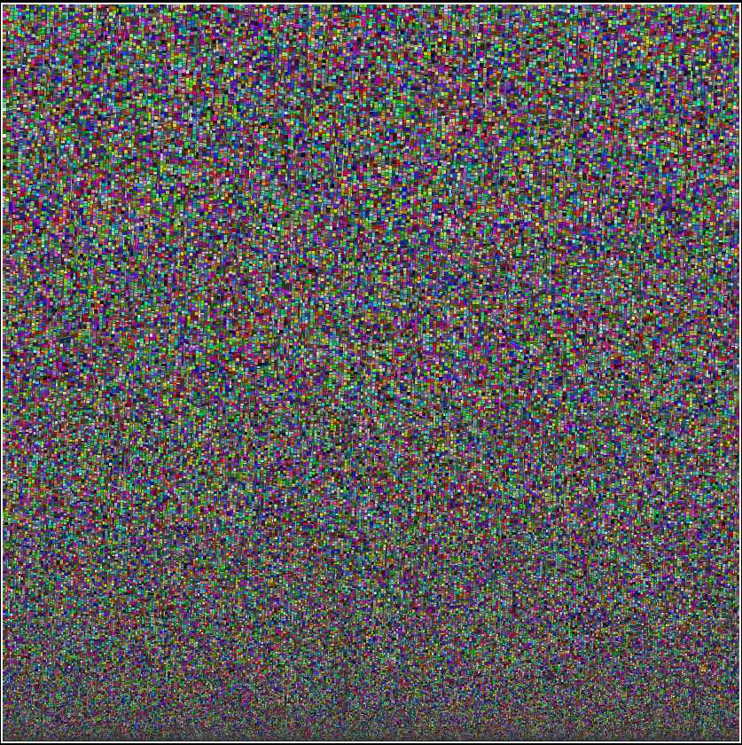

# RectPacker

A JavaScript rectangle packing library supporting three different packing algorithms:

- MaxRects (highest quality, slower)
- Guillotine (balanced)
- Skyline (fastest)

It can automatically find the smallest possible square size using a binary search approach.

---

## Features

- Packs large sets of rectangles (10k–500k+)
- Three packing algorithms
- Automatic bin size search
- Padding support
- Progress callback for debugging / UI
- Overlap-safe placement

---

## Example

```js
const packer = new RectPacker();

const rects = [
  { width: 50, height: 20 },
  { width: 30, height: 60 },
  { width: 80, height: 40 }
];

const result = await packer.pack(rects);

console.log(result.bestFit);
console.log(result.rects);
```
---

## Algorithm selection

```js
packer.algs.MAX_RECTS   // best quality
packer.algs.GUILLOTINE  // balanced speed/quality
packer.algs.SKYLINE     // fastest
```

# Force a specific algorithm:

```js
await packer.pack(rects, {
  forceAlg: packer.algs.SKYLINE
});
```

---

## Performance

Average packing times (approx.):

- 1,000 rectangles → ~182 ms  
- 10,000 rectangles → ~303 ms  
- 1,000,000 rectangles → ~6911 ms  

These values depend heavily on:
- rectangle distribution
- algorithm used
- padding settings
- bin size convergence speed

Skyline is typically fastest, MaxRects is slowest but gives the best packing efficiency.

---

## How it works

The packer finds the smallest possible square using binary search:

1. Start with an estimated size
2. Try to pack all rectangles
3. If it fails, increase size
4. If it succeeds, try smaller sizes
5. Repeat until the smallest valid size is found

---

## Algorithms

### Skyline
Maintains a dynamic top contour of the packed area. Very fast and suitable for large datasets.

### Guillotine
Splits free space into smaller rectangles after each placement. Good balance between speed and quality.

### MaxRects
Maintains a list of free rectangles and picks the best fit. Highest packing efficiency, but slower.

---

## Output

```js

{
  bestFit: number,
  rects: [
    { x, y, width, height }
  ]
}
```

---

## Progress callback

```js
await packer.pack(rects, {}, (state) => {
  console.log(state.msg);
});
```

Example output:
Packing: 50000
Using SkyLine packing (~85-92% coverage)
Trying 1024x1024...
Trying 2048x2048...
Finished!

---

## Images

### Packed result (100K rectangles)


### MaxRects
 

### Guillotine


### Skyline
